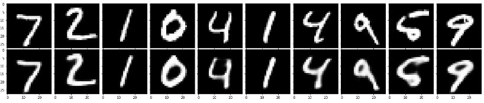
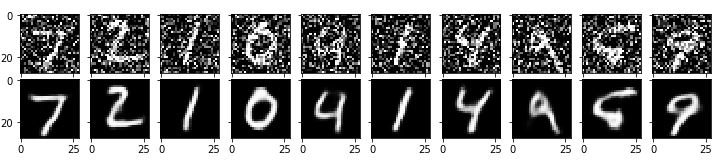
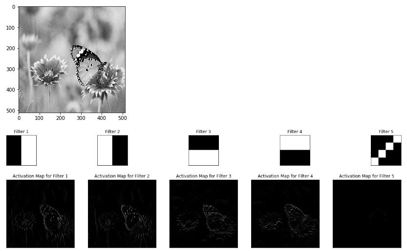
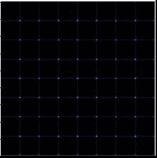

## Welcome to the Machine Learning Noob's Heaven

The repository contains some of many projects which I had done while I was a kid in Machine Learning. Currently the python notebooks are oriented more towards Deep Learning focussing on some old school DL projects which I found very interesting. For few on them it was tough for me to understand there working and to run them in Google Colab, so I wrote the notebooks trainable in Google Colab to help others.

### 1. CNN

The folder contains Python project Notebook using Convolutional Neural Networks for different purposes. Currently it has following:

* Autoencoder
* Image Classification
* Denoising Autoencoder
* Layerwise output Visualization

Folder can the accessed from [here](https://github.com/CodeLogist/ML-NewBie-s-Heaven/tree/master/CNN)

####      1.1 AutoEncoders

AutoEncoders were one of the famous image Compression algorithms. The model consists of an encoder CNN following with a decoder CNN. Folder can the accessed from [here](https://github.com/CodeLogist/ML-NewBie-s-Heaven/tree/master/CNN/Autoencoder)

####      1.2 Classification

CNNs are widely used for Image Classification tasks such as Multi-Label Classification, Multi-Class Classification and Single Label Classfication. For now this folder has MNIST Digit Classification. Folder can the accessed from [here](https://github.com/CodeLogist/ML-NewBie-s-Heaven/tree/master/CNN/Classification)

####      1.3 Denoising Autoencoder

These Deep Learning model architechure is similar to AutoEncoders but are used to serve other purpose. When noisy image is passed through this autoencoder the resultant output is the denoised clear image. Folder can the accessed from [here](hhttps://github.com/CodeLogist/ML-NewBie-s-Heaven/tree/master/CNN/Denoising%20Autoencoder)

####      1.4 Layerwise output Visualization

While studying CNN, their's always a question in my mind that "What does a node of CNN looks at?". After figuring it out I made this notebook to help others to visualize the CNN node's Vision. Folder can the accessed from [here](https://github.com/CodeLogist/ML-NewBie-s-Heaven/blob/master/CNN/Layerwise%20output%20Visualization)

### 2. GAN

The folder contains Python project Notebook using Generative Adversarial Networks for different purposes. Currently it has following:

* DCGAN
* Face Generator(GAN)

####      2.1 DCGAN

Deep Convolutional Generative Adversarial Networks use CNN for both of its component i.e Discriminator and Generator. Folder can the accessed from [here](https://github.com/CodeLogist/ML-NewBie-s-Heaven/tree/master/GAN/Deep%20Convolutional%20GAN)

####      2.2 Face Generator

GANs Application to generate Faces of those people whom neither did you or the neural network has seen before. Folder can the accessed from [here](https://github.com/CodeLogist/ML-NewBie-s-Heaven/tree/master/GAN/Face%20Generator)
